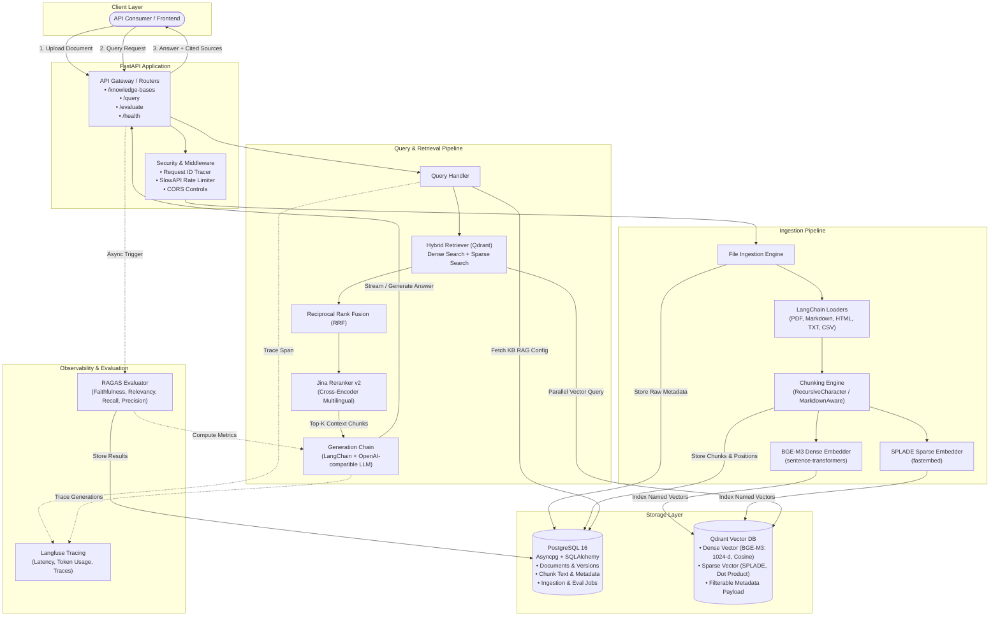
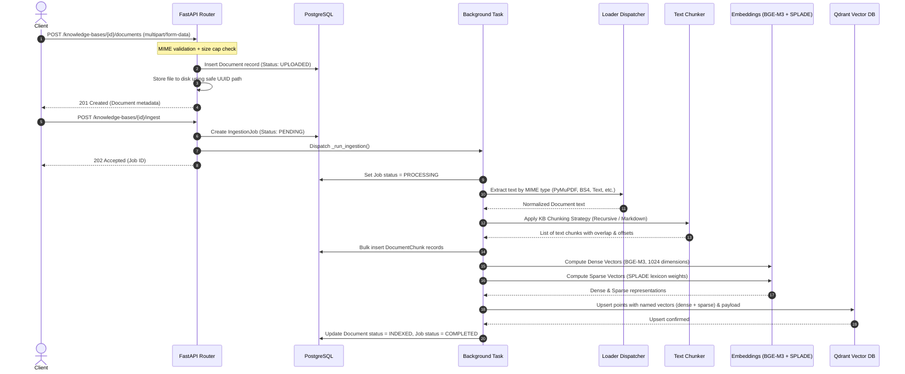
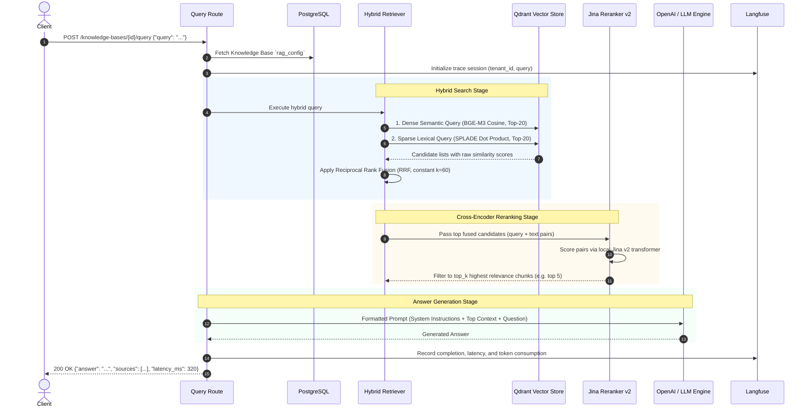

# RAG Platform V1

A production-grade, **configuration-driven** Retrieval-Augmented Generation (RAG) platform.
Swap data, chunking parameters, embedding models, and rerankers per knowledge base to power specialized domains (e.g., Legal, Healthcare, Enterprise Knowledge) without rewriting backend pipelines.

---

## System Architecture



---

## Detailed Pipeline Flows

### 1. Ingestion Pipeline (Asynchronous & Fault-Tolerant)



* **Safe File Storage**: Filenames are sanitized and mapped to disk via unique UUIDs (`rag_uploads/{doc_id}.bin`), preventing path traversal attacks.
* **Document Loaders**:
  * **PDF**: `PyMuPDFLoader` (fast, handles multi-column layouts).
  * **Markdown**: Header-aware parsing with metadata preservation.
  * **HTML**: `BSHTMLLoader` (strips scripts, styles, extracts structured text).
  * **Plain Text**: Auto-detects encoding via `chardet`.
  * **CSV**: `csv.DictReader` formats structured tabular records as key-value documents.
* **Chunking Engine**:
  * Configurable chunk size and overlap per knowledge base.
  * Preserves chunk indices, start/end character offsets, and document foreign keys for precise source citation.
* **Multi-Vector Representation**:
  * **Dense Embedding**: `BAAI/bge-m3` via `sentence-transformers` (1024-dimensional semantic dense vector).
  * **Sparse Embedding**: `prithivida/Splade_PP_en_v1` via `fastembed` (term-importance lexical weights for exact keyword matching).

---

### 2. Retrieval & Generation Pipeline (Hybrid + Reranking)



* **Hybrid Search with RRF**: Combines the semantic understanding of dense embeddings with the exact keyword matching of sparse SPLADE embeddings. Reciprocal Rank Fusion combines both ranking lists without requiring score normalization:
  $$\text{RRF Score}(d) = \sum_{m \in \{\text{dense}, \text{sparse}\}} \frac{1}{k + \text{rank}_m(d)}$$
* **Local Cross-Encoder Reranker**: `jinaai/jina-reranker-v2-base-multilingual` scores full query-document pairs in a single forward pass, eliminating false positives from initial retrieval.
* **Grounded Answer Generation**: Assembles top-ranked passages into a strict QA prompt instructing the LLM to answer using only provided context with explicit chunk citations.

---

### 3. Evaluation & Quality Assurance (RAGAS)

* **Synthetic & Golden QA Evaluation**: Upload or generate question-answer datasets with ground truth passages.
* **Automated Metrics**:
  * **Context Precision**: Evaluates whether relevant chunks were placed at the top of the context window.
  * **Context Recall**: Measures whether all necessary facts from the ground truth were retrieved.
  * **Faithfulness**: Detects hallucinations by ensuring every claim in the answer is backed by retrieved context.
  * **Answer Relevancy**: Assesses how directly the answer addresses the user's prompt.
* **Non-Blocking Execution**: Evaluator runs in separate thread workers (`asyncio.to_thread`) to ensure the main API event loop remains responsive under load.

---

## Technology Stack

| Layer | Technology | Details |
|---|---|---|
| **API Framework** | FastAPI + Uvicorn | Async ASGI framework with OpenAPI/Swagger interactive docs |
| **Relational Database** | PostgreSQL 16 | Primary store for documents, chunk text, job state, and metadata |
| **ORM & Migrations** | SQLAlchemy 2.0 (asyncpg) + Alembic | Full async ORM for queries, sync psycopg2-binary for migrations |
| **Vector Database** | Qdrant 1.12+ | Hybrid vector storage with named dense (`Cosine`) and sparse (`Dot`) vectors |
| **Dense Embeddings** | `BAAI/bge-m3` | 1024-dimensional multilingual embeddings via `sentence-transformers` |
| **Sparse Embeddings** | `SPLADE_PP_en_v1` | Lexical expansion and term-weighting via `fastembed` |
| **Reranker** | Jina Reranker v2 | Local cross-encoder via Hugging Face `transformers` (`BaseDocumentCompressor`) |
| **LLM Provider** | OpenAI / OpenAI-compatible | Compatible with OpenAI, vLLM, Ollama, LocalAI, and Azure OpenAI |
| **Orchestration** | LangChain Core & Community | Document loaders, text splitters, and retrieval chains |
| **Observability** | Langfuse | Distributed request tracing, latency tracking, token usage |
| **Evaluation** | RAGAS + Datasets | Automated evaluation metrics for retrieval and generation accuracy |
| **Security & Limits** | SlowAPI | Sliding window rate limiting on API endpoints |

---

## Configuration-Driven Design (`rag_config`)

Each Knowledge Base stores an isolated `rag_config` JSON configuration that controls the pipeline execution:

```json
{
  "chunking": {
    "strategy": "recursive",
    "chunk_size": 800,
    "chunk_overlap": 100
  },
  "embedding": {
    "provider": "bge_m3",
    "model": "BAAI/bge-m3",
    "device": "cpu"
  },
  "retrieval": {
    "dense": true,
    "sparse": true,
    "dense_top_k": 20,
    "sparse_top_k": 20,
    "fusion": "rrf"
  },
  "reranking": {
    "enabled": true,
    "provider": "jina",
    "model": "jinaai/jina-reranker-v2-base-multilingual",
    "top_k": 5
  },
  "generation": {
    "provider": "openai",
    "model": "gpt-4o-mini",
    "temperature": 0.0,
    "max_tokens": 2048
  },
  "prompt": {
    "version": "qa_v1"
  }
}
```

---

## Quick Start

### 1. Environment Setup

```bash
cp .env.example .env
# Edit .env — specify your database connection, Qdrant host, and OPENAI_API_KEY
```

### 2. Run with Docker Compose

```bash
docker compose up -d
```
* Services running:
  * **API**: `http://localhost:8000` (Docs at `http://localhost:8000/docs`)
  * **PostgreSQL**: `localhost:5432`
  * **Qdrant**: `http://localhost:6333`

### 3. Run Database Migrations

```bash
docker compose exec api alembic upgrade head
```

---

## API Endpoints

| Method | Endpoint | Description |
|---|---|---|
| `GET` | `/health` | Health probe (PostgreSQL + Qdrant connectivity) |
| `POST` | `/knowledge-bases` | Create a new knowledge base with custom `rag_config` |
| `GET` | `/knowledge-bases` | List knowledge bases by tenant |
| `GET` | `/knowledge-bases/{id}` | Retrieve knowledge base details |
| `POST` | `/knowledge-bases/{id}/documents` | Multipart document upload (PDF, TXT, MD, HTML, CSV) |
| `GET` | `/knowledge-bases/{id}/documents` | List uploaded documents and ingestion statuses |
| `POST` | `/knowledge-bases/{id}/ingest` | Trigger async background ingestion |
| `GET` | `/ingestion-jobs/{id}` | Check ingestion progress, status, and error logs |
| `POST` | `/knowledge-bases/{id}/query` | Execute hybrid retrieval and generate answer |
| `POST` | `/knowledge-bases/{id}/datasets` | Create benchmark evaluation dataset |
| `POST` | `/knowledge-bases/{id}/evaluate` | Trigger asynchronous RAGAS evaluation run |
| `GET` | `/knowledge-bases/{id}/evaluation-runs/{run_id}` | Retrieve evaluation metrics and scores |

---

## End-to-End API Usage Example

```bash
# 1. Create a Knowledge Base
curl -X POST http://localhost:8000/knowledge-bases \
  -H "Content-Type: application/json" \
  -d '{"name": "internal-wiki", "tenant_id": "team-engineering"}'

# 2. Upload Document
curl -X POST http://localhost:8000/knowledge-bases/<KB_ID>/documents \
  -F "files=@docs/architecture.pdf"

# 3. Trigger Ingestion Job
curl -X POST http://localhost:8000/knowledge-bases/<KB_ID>/ingest

# 4. Check Job Status
curl http://localhost:8000/ingestion-jobs/<JOB_ID>

# 5. Query Knowledge Base
curl -X POST http://localhost:8000/knowledge-bases/<KB_ID>/query \
  -H "Content-Type: application/json" \
  -d '{"query": "How is the hybrid retrieval pipeline configured?"}'
```

---

## Testing

Run unit and integration suites locally:

```bash
# Install development dependencies
pip install -e ".[dev]"

# Run unit tests (fast, offline)
pytest tests/unit/ -v

# Run integration tests (validates live endpoints against database)
pytest tests/integration/ -v
```

---

## Disaster Recovery

To rebuild a Qdrant collection from scratch using raw document chunks persisted in PostgreSQL:

```bash
python scripts/rebuild_qdrant_index.py --kb-id <KB_UUID>
```
